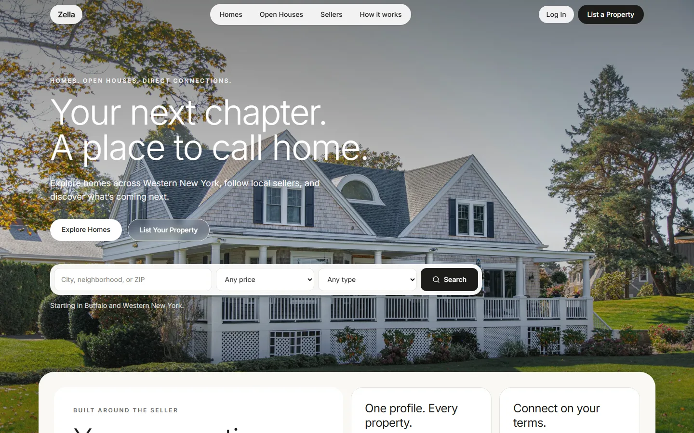
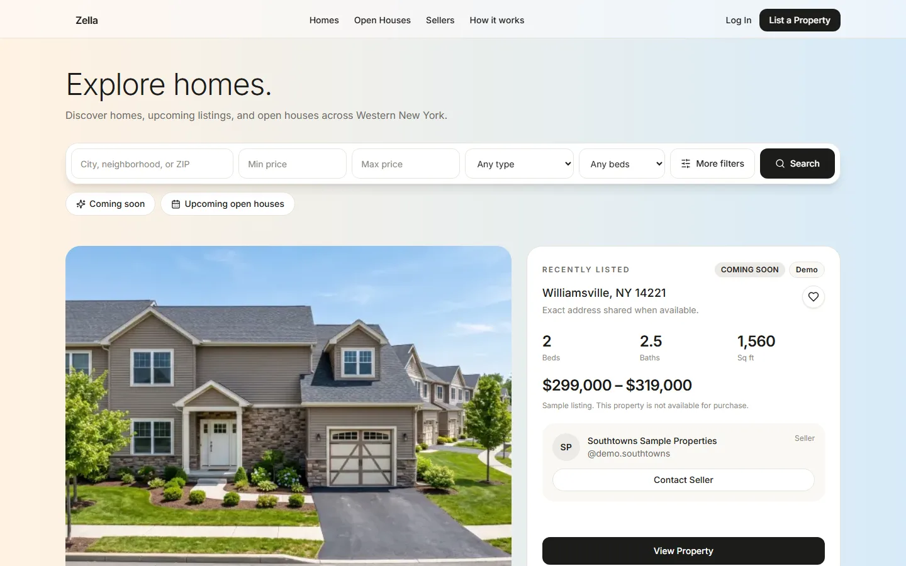
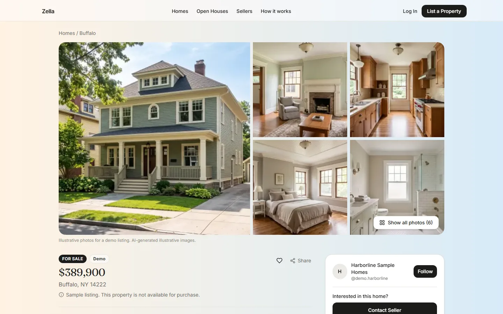
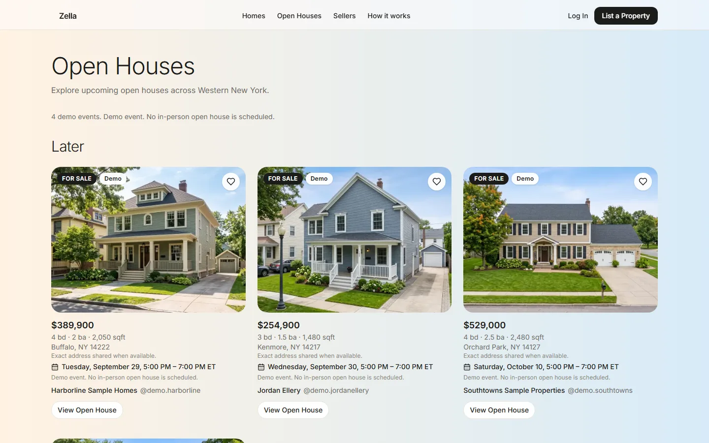
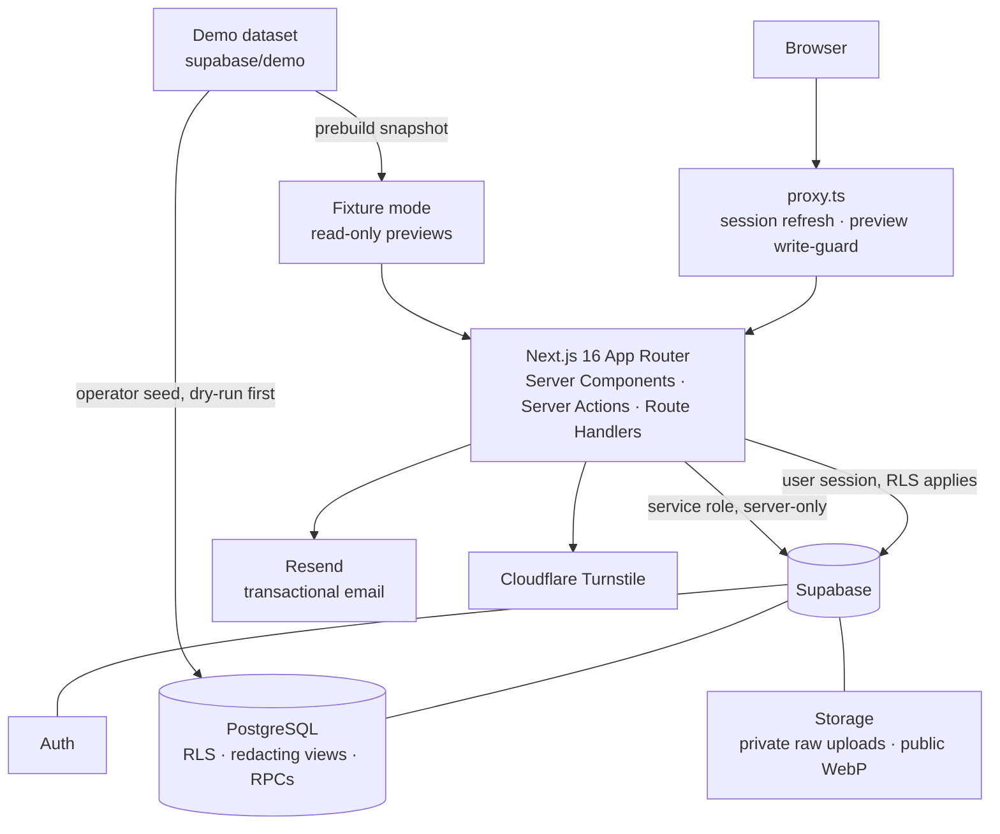
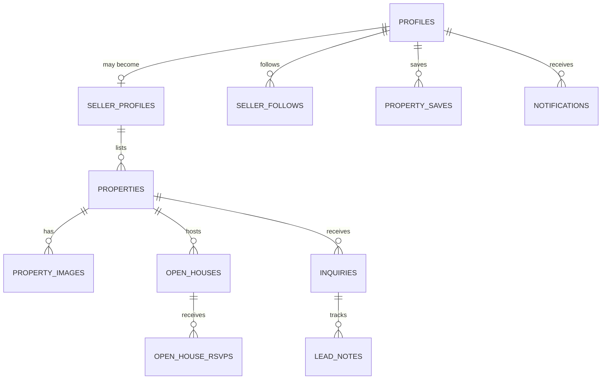

# Zella

A seller-first residential real estate platform: homeowners publish listings, host open houses and work their own buyer leads, while buyers browse and reach sellers directly.

[](https://github.com/KevinOBautista/zella/actions/workflows/ci.yml)


<!-- Live demo: add the production URL here once the public domain is set. -->



| Explore homes | Property page | Open houses |
|---|---|---|
|  |  |  |

## Overview

Selling a home usually means handing the listing, the showings and every buyer conversation to someone else. Zella gives sellers those tools directly. A seller gets a public profile and portfolio, a structured workflow for publishing a property, a way to schedule open houses, and a workspace for the buyer inquiries each listing generates.

Buyers don't need an account to browse homes, open houses and sellers, or to send an inquiry or RSVP. Signing in adds saved homes, followed sellers and notifications. When a buyer inquires, the lead goes straight to the seller's dashboard, and the seller follows up by email or phone. V1 deliberately has no in-app messaging, which keeps the product focused on getting a qualified lead to the seller.

The first market is Buffalo and Western New York. Zella is a marketing and lead-management platform. It is not a brokerage, and it does not handle offers, contracts or closings.

The architecture treats the database as the security boundary. Postgres row-level security, redacting views and transactional RPCs enforce privacy and business rules. The Next.js layer never trusts the client, but it doesn't have to be the only thing that stops a bad request.

## Core capabilities

**Property discovery**
- Search and filter homes by location, price, beds, baths, square footage, type and status, with URL-driven state and pagination
- Featured listing, Coming Soon listings and an upcoming-open-house filter
- Property pages with photo galleries, features, optional YouTube/Vimeo tours and seller context
- Three levels of address visibility, so a seller can publish before sharing their street address

**Seller tools**
- A 7-step listing wizard: property, sale status, details, price, description and features, photos, then review and publish
- A listing lifecycle with draft, Coming Soon, For Sale, Under Contract, Sold, paused and archived states
- Photo upload with drag-and-drop ordering and cover selection, plus a shareable QR code for each listing
- Open-house scheduling and cancellation, with an attendee list for each event
- A lead workspace: inquiries across seven pipeline stages in board and list views, with filters, notes and activity history
- A public seller profile at `/@username`, with followers and a portfolio

**Buyer experience**
- Inquiries and open-house RSVPs as a guest or signed-in user
- Saved homes, followed sellers, and in-app notifications when a followed seller publishes
- Seller directory and seller profiles

**Identity and access**
- Email and password auth with verification and password reset
- Onboarding that asks for intent first, so a buyer can become a seller at any time
- Seller, buyer and admin roles, with the dashboard, account and admin areas protected on the server
- An admin area for reviewing users, moderating sellers and properties, handling reports, and viewing an audit log

## Architecture



**Frontend.** Next.js 16 with the App Router, React 19 and strict TypeScript. Styling is Tailwind CSS v4 with a small set of in-house UI components. Forms use React Hook Form with Zod, and the same Zod schemas validate input again on the server. Code is organized by feature. Each folder in `src/features/*` owns its `queries`, `actions`, pure `domain` rules, `schemas` and components. Route groups keep public, auth, dashboard, account, admin and onboarding layouts separate.

**Backend.** Supabase provides Postgres, Auth and Storage. Pages read data in Server Components using the caller's session, and every write goes through a server action. The service-role key is confined to a few server-only code paths, such as guest submissions and image processing. Multi-step state changes run as Postgres functions, so each one happens atomically.

**Deployment.** Vercel hosts production against hosted Supabase. Preview deployments are forced into a read-only fixture mode that has no database credentials at all.

**Data.** There are 27 tables across 16 SQL migrations, with types generated from the schema. Prices are stored as integer cents and timestamps as `timestamptz`. Open-house times are always shown in `America/New_York`.

More detail in [docs/architecture.md](docs/architecture.md).

## Engineering highlights

**The database is the privacy boundary.** The Supabase anon key ships to the browser, so any readable table can be queried with arbitrary columns. Listings, sellers and open houses therefore have no public `SELECT` policy at all. Public pages read from `security_barrier` views that compute the redacted projection in SQL. For example, a street address is `NULL` unless the seller chose to show it. Hidden data can't leak through a forgotten `select("*")`. Integration tests query the views as the anonymous role to prove it.

**Atomic listing lifecycle.** Every status change goes through one `SECURITY DEFINER` RPC. It re-derives the caller from `auth.uid()`, applies the state machine, checks publish requirements and enforces the per-seller active-listing limit under a row lock. A concurrency test fires simultaneous publishes and asserts the limit holds.

**Demo data that can't be mistaken for real data.** The sample homes and sellers are separated by the database, not only by the UI. Database triggers reject any inquiry, RSVP, save or follow that targets demo content, for every role. Demo rows can only be written by trusted server operations, and a single visibility switch is honored by both the views and RLS. In the UI, demo content is labeled, set to `noindex`, left out of the sitemap and sorted after real listings.

**Previews that can't touch production.** `VERCEL_ENV=preview` forces fixture mode. Supabase credentials are blanked at build time, pages render a static snapshot of the demo dataset, and the proxy returns 403 for every write, API and auth route. A bundle scanner (`npm run check:bundle`) checks built output for secret values and names.

**Migrations tested without Docker.** The default test suite applies every migration to an embedded Postgres (PGlite) with a small Supabase shim. RLS policies, triggers and RPCs are exercised in plain `npm test` and in CI, with no services or secrets required.

**Untrusted uploads, trusted output.** Browsers upload directly to a private bucket through signed URLs. The server detects the file type from magic bytes, then uses Sharp to auto-orient, resize and re-encode it to WebP, which strips EXIF and GPS metadata. Only then is the image published to the public bucket at an unguessable path. Each failure path cleans up after itself.

**Guest forms built for abuse.** Inquiry, RSVP and report forms run Zod validation, a honeypot, Turnstile and a Postgres rate limiter keyed on an HMAC of the IP. Idempotency keys make a double submit return the original record. The lead is always saved before notifications run, so an email outage can't lose a lead.

## Repository structure

```
src/
├── app/                 # App Router: (landing), (public), (auth), dashboard/, account/, admin/, onboarding/, api/
├── features/            # Feature modules: properties, leads, open-houses, sellers, demo, admin, …
├── components/          # Shared layout and UI primitives
├── lib/                 # Supabase clients, auth guards, images, rate limiting, email, dates, money
├── config/              # Brand, validated env, limits, runtime data mode
├── emails/              # React Email templates
└── types/               # Generated database types
supabase/
├── migrations/          # Schema, RLS, views, RPCs, storage policies
├── demo/                # Public demo dataset and its photo manifest
└── fixtures/dev/        # Synthetic data for local development
scripts/                 # Operator and tooling CLIs (demo seeding, fixture restore, bundle check)
tests/                   # unit/, db/ (PGlite), integration/ (local Supabase)
docs/                    # Architecture notes and screenshots
```

## Data model



Supporting tables cover roles, features, reports, lead activity, email delivery logs, rate-limit hits and admin audit logs. Profile-level inquiries, where a buyer contacts a seller without choosing a property, have no property id. Soft deletion preserves moderation and audit history.

## Demo environment

The deployed product includes a small, clearly labeled demo dataset so the full experience can be evaluated: 3 fictional sellers, 8 homes across Western New York, and 4 open houses. The photos are AI-generated and credited as illustrative.

Demo records are marked in the database and can't receive real interactions. Every surface identifies them as demo content. Real listings always rank ahead of them, and search engines don't index them. Real user data is never mixed into the demo dataset, and the local development fixtures (`supabase/fixtures/dev`) are a separate synthetic set that is only ever restored into a local database.

## Local development

Requires Node.js 20.9 or later.

```bash
git clone https://github.com/KevinOBautista/zella.git
cd zella
npm install
cp .env.example .env.local
npm run dev
```

There are two ways to run it:

- **Without a backend.** Set `NEXT_PUBLIC_DATA_MODE=fixtures` in `.env.local` and run `npm run preview:fixtures` before `npm run dev`. The app renders the demo dataset read-only.
- **With a local Supabase stack** (Docker). Run `npx supabase start`, then `npx supabase db reset` to apply the migrations. Copy the local keys into `.env.local`, then run `npm run fixtures:restore` to load the synthetic development data.

Environment variables:

```
NEXT_PUBLIC_SUPABASE_URL=
NEXT_PUBLIC_SUPABASE_ANON_KEY=
SUPABASE_SERVICE_ROLE_KEY=          # server-only
NEXT_PUBLIC_SITE_URL=
RATE_LIMIT_IP_SALT=                 # server-only
NEXT_PUBLIC_DATA_MODE=              # optional: "fixtures"
RESEND_API_KEY=                     # optional: without it, emails render to .dev-emails/
RESEND_FROM_EMAIL=                  # optional
NEXT_PUBLIC_TURNSTILE_SITE_KEY=     # optional
TURNSTILE_SECRET_KEY=               # optional, server-only
SEED_USER_PASSWORD=                 # optional, local fixtures only
```

Server variables are validated with Zod on first use (`src/config/env.ts`). A missing value fails fast and names the variable.

## Scripts

| Command | Purpose |
|---|---|
| `npm run dev` | Development server |
| `npm run build` / `npm start` | Production build and server |
| `npm run lint` | ESLint (Next.js rules, React Compiler checks, import boundaries) |
| `npm run typecheck` | `tsc --noEmit` |
| `npm test` | Unit and database tests (no services required) |
| `npm run test:integration` | Integration tests against a local Supabase stack |
| `npm run db:types` | Regenerate database types from the local schema |
| `npm run fixtures:restore` | Load synthetic development data into a local stack |
| `npm run preview:fixtures` | Build the read-only fixture snapshot |
| `npm run check:bundle` | Scan a build for leaked secrets or server-only identifiers |

The `demo:*` and `admin:grant` scripts are operator tools. They are dry runs by default and refuse to run on Vercel or in CI.

## Security

- **Least privilege in the database.** RLS is enabled and deny-by-default on every table. Public reads go only through redacting views. Mutating RPCs re-derive the caller and check ownership or admin role themselves, and the default `anon` execute grant on functions is revoked.
- **Server-side authorization.** Protected layouts and every server action resolve the user on the server. Client-supplied ids are always re-checked against ownership.
- **Secrets stay on the server.** Secrets are read only from `server-only` modules, so importing one into client code fails the build. `.env*.local` files are gitignored, and a bundle scanner checks build output.
- **Input handling.** Zod validation runs on the client and again on the server. Guest forms add a honeypot, Turnstile, IP-hashed rate limits and idempotency keys. Uploaded images are checked by their magic bytes and have their metadata stripped.
- **Headers.** The app sets a Content-Security-Policy, `frame-ancestors 'none'`, `nosniff`, a referrer policy and a permissions policy.

One known gap: the CSP still allows inline scripts, and nonce-based script loading is on the roadmap.

## Product status

**Implemented:** property discovery and search, property pages, the listing wizard and lifecycle, photo management, seller profiles and follows, open houses and RSVPs, buyer inquiries, the seller lead workspace, buyer accounts (saved homes, following, RSVPs, notifications), transactional email, the admin area and moderation, and the demo environment.

**Planned:** seller analytics, in-app messaging, and support for more markets.

## Engineering roadmap

- End-to-end browser tests for the core seller and buyer flows
- Nonce-based CSP
- Error monitoring and structured logging
- Analytics event pipeline for seller insights
- Accessibility audit and fixes
- Image delivery tuning (responsive sizes, placeholders)

## Author

Built by [Kevin Bautista](https://github.com/KevinOBautista).

## License

Proprietary. All rights reserved. This source is published for review only. See [LICENSE](LICENSE).
